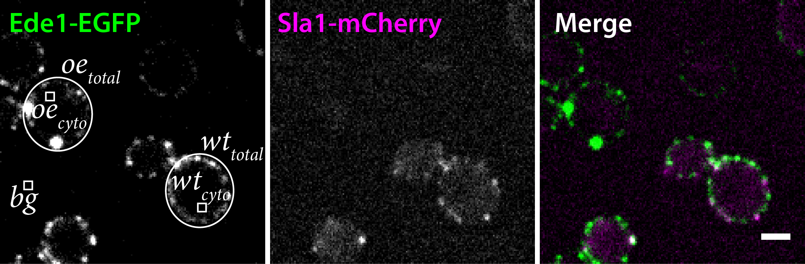

```{r setup, include=FALSE}
knitr::opts_chunk$set(echo = FALSE, message=FALSE, warning=FALSE,
                      dpi = 96, fig.width = 7, fig.height = 5)
```

```{r libs}
library(tidyverse) # I make a lot of use of dplyr and other tidyverse packages
```

```{r load}
rm(list = ls())
intensities <- read_csv('data/ede1_gal_induction.csv') 
```

```{r theme}
# Custom ggplot2 theme
# --------------------

# minimal theme with border
# based on theme_linedraw without the grid lines
# also trying to remove all backgrounds and margins
# the aim is to make it as easy as possible to edit in illustrator

theme_frap <- function(base_size = 11, base_family = "",
                        base_line_size = base_size / 22,
                        base_rect_size = base_size / 22) {
  theme_linedraw(
    base_size = base_size,
    base_family = base_family,
    base_line_size = base_line_size,
    base_rect_size = base_rect_size
  ) %+replace%
    theme(
      # no grid and no backgrounds if I can help it
      legend.background =  element_blank(),
      panel.background = element_blank(),
      panel.grid = element_blank(),
      plot.background = element_blank(),
      plot.margin = margin(0, 0, 0, 0),
      complete = TRUE
    )
}

# Set default theme
# -----------------
theme_set(theme_frap(base_size = 14, base_family = "Myriad Pro"))

# Create a ggsave wrapper
# -----------------------

# This way we can set a default size and device for all plots
my_ggsave <- function(filename, plot = last_plot(),
                      device = cairo_pdf, units = "mm",
                      width = 120, height = 90, ...){
  ggsave(filename = filename, plot = plot,
         device = device, units = units,
         height = height, width = width,  ...)
  }
```

# {.tabset}

## Experiment

### Premise

The aim of this experiment is to probe the cytosolic concentration of Ede1
after induction of expression from the GALS promoter.

The prediction from a pure phase separation model 
based on homotypic interactions
is that the cytosolic concentration would be buffered, 
as the dense and light phase concentrations are fixed, 
and only the volume fraction changes as total concentration increases.

The prediction from a pure scaffold-binding model 
is that light phase concentration can increase, 
and the size of the structures is limited by the availability of the scaffold.

Phase separation driven by heterotypic interactions
would be more complex, as the phase separation would depend
both on concentration and relative stoichiometry
of phase-separating components.

### Yeast growth

Yeast strains MKY4405 ('oe', *GALSpr-EGFP-EDE1*)
and MKY0379 ('wt', *EDE1-EGFP, SLA1-mCherry*) 
were grown on an SC-Gal plate. 
They were cultured overnight 
in a liquid SC-Trp medium with 2% Raffinose as the carbon source, 
diluted in the morning to OD600 = 0.2 
in SC-Trp medium with 2% glucose as the carbon source and grown for ~4h. 
The two strains were mixed in equal amounts and attached to a coverslip.
~15 minutes before the start of the movies, 
the medium on the coverslip was exchanged 
to SC-Trp with 2% galactose as the carbon source.

### Imaging

The yeast were imaged on a Nikon Ti with Yokogawa CSW-1 spinning disk confocal. 
Both channels were acquired with single bandpass filters 
for their respective wavelengths (excitation using 488 and 561 nm lasers). 
Exposure time and laser power were equal for both (400 ms / 100%), 
with 5-minute intervals between frames.
GFP signal was acquired with camera gain 1 and mCherry with gain 3.
Perfect Focus system was used throughout the movie.

### Processing

The movies were first corrected for drift 
using the StackReg FIJI plugin from EPFL-BIG.

Regions of interest were selected manually
and measured over the entire duration of the movies.
Background and cytosolic intensities were measured over 5 px square regions.
Care was taken to avoid condensates and, if possible, 
dark vacuolar regions in the cytosolic ROIs.
The cellular signal was measured from oval ROIs on the same cells
(these are single-plane movies).

Cell selection:

* wt => cells bearing both markers
* oe => cells having only GFP and showing condensates in the focal plane



## Results {.tabset .tabset-pills}

```{r summarise}
mean_intensities <- intensities %>%
  group_by(time, signal) %>%
  # signal variable combines strain and localization for now
  # generate statistics for each signal at each timepoint
  summarise(mean = mean(intensity), sd = sd(intensity), n = n(), se = sd(intensity) / sqrt(n())) %>%
  # generate wide format data: each statistic gets its own column for each signal
  pivot_wider(names_from = signal, values_from = c(mean, sd, se, n)) %>%
  # use the new columns to generate background-subtracted calues (x_corr)
  # and the ratio (corrected oe divided by wt for each localization)
  # and propagate the errors
  mutate(corr_wt.cyto = mean_wt.cyto - mean_bg,
         corr_wt.total = mean_wt.total - mean_bg,
         corr_oe.cyto = mean_oe.cyto - mean_bg,
         corr_oe.total = mean_oe.total - mean_bg,
         corr.sd_wt.cyto = sqrt(sd_wt.cyto ^ 2 + sd_bg ^ 2),
         corr.sd_wt.total = sqrt(sd_wt.total ^ 2 + sd_bg ^ 2),
         corr.sd_oe.cyto = sqrt(sd_oe.cyto ^ 2 + sd_bg ^ 2),
         corr.sd_oe.total = sqrt(sd_oe.total ^ 2 + sd_bg ^ 2),
         corr.se_wt.cyto = sqrt(se_wt.cyto ^ 2 + se_bg ^ 2),
         corr.se_wt.total = sqrt(se_wt.total ^ 2 + sd_bg ^ 2),
         corr.se_oe.cyto = sqrt(se_oe.cyto ^ 2 + se_bg ^ 2),
         corr.se_oe.total = sqrt(se_oe.total ^ 2 + sd_bg ^ 2),
         corr_ratio.cyto = corr_oe.cyto / corr_wt.cyto,
         corr.sd_ratio.cyto = corr_ratio.cyto* sqrt(
           (corr.sd_oe.cyto / corr_oe.cyto) ^ 2 + (corr.sd_wt.cyto / corr_wt.cyto) ^ 2),
         corr.se_ratio.cyto= corr_ratio.cyto* sqrt(
           (corr.se_oe.cyto / corr_oe.cyto) ^ 2 + (corr.se_wt.cyto / corr_wt.cyto) ^ 2), 
         corr_ratio.total = corr_oe.total / corr_wt.total,
         corr.sd_ratio.total = corr_ratio.total * sqrt(
           (corr.sd_oe.total / corr_oe.total) ^ 2 + (corr.sd_wt.total / corr_wt.total) ^ 2),
         corr.se_ratio.total = corr_ratio.total * sqrt(
           (corr.se_oe.total / corr_oe.total) ^ 2 + (corr.se_wt.total / corr_wt.total) ^ 2) 
  )

# go back to long format data: it's near unreadable, but easier to plot
mean_intensities_long <- mean_intensities %>%
  pivot_longer(!time, #process everything except for time
               names_to = c('.value', 'signal'), # new variables
               names_sep = '_') %>% # generate values for new variables
  separate(signal, c('strain', 'localization'), sep = '[.]') %>%
  mutate(localization = recode_factor(localization,
                               'total' = 'Cellular',
                               'cyto' = 'Cytosolic',
                               ))
```

### Raw plot

This plot shows three classes of signal intensity: 
  
  * background, 
  * EGFP-Ede1 in overexpressing cells, and 
  * Ede1-EGFP in wild-type cells.

Line is mean, shaded area is 95% confidence interval.

```{r}
raw_plot <- ggplot(intensities,
                   aes(x = time, y = intensity)) +
  scale_color_brewer(palette = 'Set2')+
  scale_fill_brewer(palette = 'Set2')+
  stat_summary(aes(colour = signal),
               fun.y = mean, geom = 'line', na.rm = T)+
  stat_summary(aes(fill = signal),
               fun.data = 'mean_cl_normal',
               #fun.args = list(mult = 1), # mult = how many deviations
               geom = 'ribbon', alpha = 0.3, na.rm = T)
print(raw_plot)
``` 

### Background corrected

Plot shows two classes of signal intensity:
  
  * EGFP-Ede1 in overexpressing cells, and
  * Ede1-EGFP in wild-type cells.
  
Both were corrected by subtracting the background value.

Line is mean +/- 2xSEM (95% confidence interval based on normal distribution); 
uncertainty of background measurements has been propagated during subtraction.

```{r}
#base_plot <- ggplot(mean_intensities)

corr_plot <- mean_intensities_long %>%
  filter(strain == 'wt' | strain == 'oe' ) %>%
  mutate(time = time / 60) %>%
    ggplot(aes(x = time)) +
    geom_line(aes(y = corr,
                  colour = strain))+
    geom_ribbon(aes(ymin = corr - 2 * corr.se,
                    ymax = corr + 2 * corr.se,
                    fill = strain),
                alpha = 0.3)+
    scale_color_brewer(palette = 'Set2')+
    scale_fill_brewer(palette = 'Set2')+
    facet_grid(rows = vars(localization),
               scales = 'free',
               )+
    scale_x_continuous(breaks = seq(0, 8, 2))+
    labs(x="Time (h)", y = "Mean fluorescence intensity (a.u.)")

print(corr_plot)
my_ggsave('figures/corrected.pdf')
```


### Normalized

Plot shows cytosolic intensity of EGFP-Ede1 in overexpressing cells 
normalized in respect to the Ede1-EGFP cytosolic intensity in wild-type cells. 
Both were corrected prior to division by subtracting the background value.

Line is mean +/- 2xSEM (95% confidence interval based on normal distribution); 
errors from subtraction and division have been propagated.

```{r}
ratio_plot <- mean_intensities_long %>%
  filter(strain == 'ratio') %>%
    ggplot(aes(x = time)) +
    geom_line(aes(y = corr, color = localization))+
    geom_ribbon(aes(ymin = corr - 2 * corr.se,
                    ymax = corr + 2 * corr.se,
                    fill = localization), alpha = 0.3)+
    scale_color_brewer(palette = 'Set2')+
    scale_fill_brewer(palette = 'Set2')+
    labs(x="Time (min)", y = "Normalized intensity")

print(ratio_plot)
my_ggsave('figures/ratio.pdf')
```

## Source data

```{r}
# save image
save.image(file = 'data/ede1_gal_induction.RData')
```

### .csv (raw intensities)

```{r echo=FALSE}
xfun::embed_file('data/ede1_gal_induction.csv')
```

### .RData (everything)

```{r echo=FALSE}
xfun::embed_file('data/ede1_gal_induction.RData')
```
