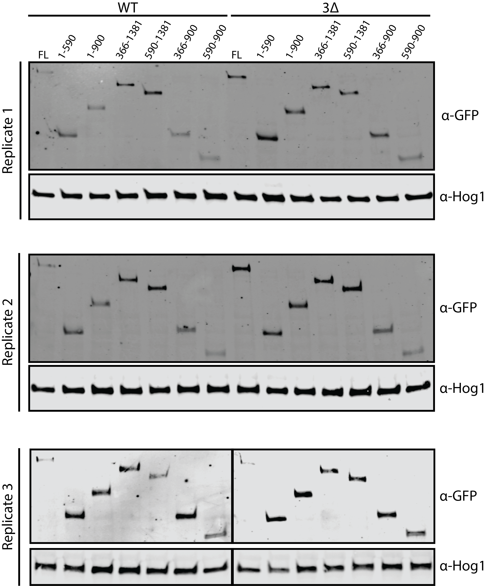

```{r setup, include=FALSE}
knitr::opts_chunk$set(echo = FALSE, message=FALSE, warning=FALSE,
                      dpi = 96)
```

# {.tabset .tabset-pills}

## Experiment

```{r libs}
library(tidyverse)
```

```{r load_data}
# clean workspace
rm(list = ls())

bands <- read_csv('data/20200814_quant.csv',
                  col_types = cols (dataset = col_factor(NULL),
                        Ede1 = col_factor(NULL),
                        background = col_factor(NULL)))
```

### Rationale

EGFP-tagged Ede1 truncation constructs
expressed in wild-type or 3∆ background cells
were probed by an anti-GFP antibody
and an anti-Hog1 loading control.
Fluorescent antibodies were used as secondaries and
imaged on a LICOR Odyssey.
See protocol for details; the experiment was repeated three times.
It was quantified using the ImageJ gel analysis tool.

### Strain list

```{r strains}
bands %>% 
  select(strain, background, Ede1) %>%
  distinct() %>%
  knitr::kable()
```


## Results {.tabset}

### All data

`ratio` : ratio of Ede1 to Hog1 fluorescence intensity.

`ratio_norm` : fluorescence ratio
normalized to full-length Ede1 in wild-type background,
individually within each dataset.

```{r}
bands %>% knitr::kable()
```

### Summary statistics

```{r}
bands %>%
  select(strain, Ede1, background, ratio, ratio_norm) %>%
  group_by(Ede1, background) %>%
  summarise(across(starts_with("ratio"),
                   list(mean = mean, sd = sd)))%>%
  knitr::kable()
```

### Blot figure



### Bar plot

```{r}
theme_frap <- function(base_size = 11, base_family = "",
                       base_line_size = base_size / 22,
                       base_rect_size = base_size / 22) {
  # minimal theme with border
  # based on theme_linedraw without the grid lines
  # also trying to remove all backgrounds but plot_background won't set to blank
  theme_linedraw(
    base_size = base_size,
    base_family = base_family,
    base_line_size = base_line_size,
    base_rect_size = base_rect_size
  ) %+replace%
    theme(
      # no grid and no backgrounds if I can help it
      plot.background = element_blank(),
      panel.background = element_blank(),
      panel.grid = element_blank(),
      
      complete = TRUE
    )
}

plot <- ggplot(bands, aes(x = Ede1, y = ratio_norm,
                          group = background, fill = background))+
    theme_frap(base_size = 14, base_family = "Myriad Pro")+
    scale_y_continuous(labels = scales::label_percent(suffix = ''))+
    labs(title = NULL,
       y = 'Normalized band intensity (% of wt)')
```


```{r}
plot + 
  stat_summary(fun.y = mean, geom = "bar",
               position = position_dodge(),
               width = 0.5, colour = 'black')+
  stat_summary(fun.data = 'mean_sdl', geom = 'errorbar',
               position = position_dodge(width = 0.5),
               fun.args = list(mult = 1), width = 0.3)+
  geom_point(aes(shape = dataset),
             position = position_jitterdodge(jitter.width = 0.4, 
                                             dodge.width = 0.5),
             size = 2, show.legend = FALSE)+
  scale_fill_grey(start = 1, end = 0.5)+
  scale_shape_manual(values = c(21:25))+
  theme(legend.position = c(0.95, 0.95),
        legend.justification = c("right", "top"),
        #legend.box.just = "right",
        legend.margin = margin(0, 6, 6, 6),
        legend.background = element_rect(fill = NULL, colour = 'black',
                                         size = 0.5),
        legend.title = element_blank())

ggsave('figures/truncation_blots.pdf', device = cairo_pdf, width = 160, height = 100, units = "mm")
```

### Faceted point + line plot

```{r}
plot + 
  stat_summary(fun.y = mean, geom = "errorbar",
               aes(ymax = ..y.., ymin = ..y..),
               width = 0.5, size = 1)+
  stat_summary(fun.data = 'mean_sdl', geom = 'errorbar',
               fun.args = list(mult = 1), width = 0.2)+
  geom_point(aes(shape = dataset, fill = dataset),
             position = position_jitter(width = 0.1),
             size = 2, show.legend = FALSE)+
  scale_fill_grey(start = 1, end = 0.5)+
  scale_shape_manual(values = c(21:25))+
  theme(axis.text.x = element_text(angle = -45,
                                   vjust = 0.1, hjust = 0.1))+
  facet_grid(rows = vars(background))

ggsave('truncation_blot_facet.pdf', device = cairo_pdf, width = 120, height = 120, units = "mm")
```

## Session info

```{r session, message=TRUE}
sessionInfo()
```
